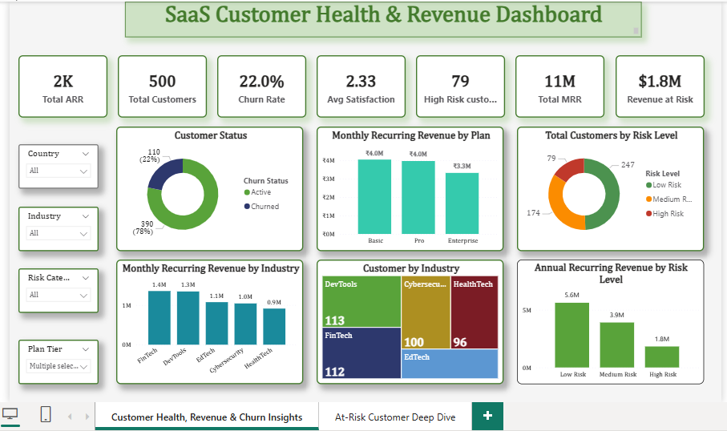
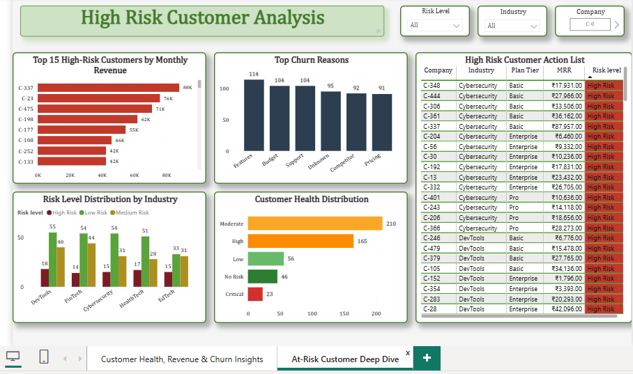
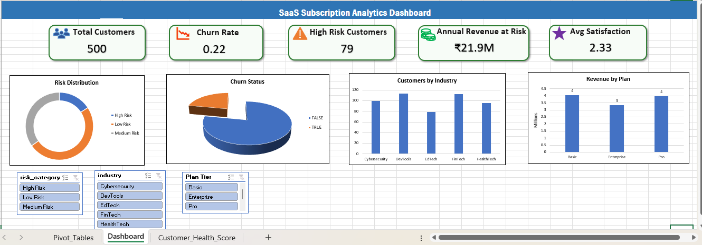

# SaaS Customer Churn Early Warning System

## Business Problem
A SaaS company with 500 customers faces a 22% annual churn rate - 110 customers lost with no early warning system. This project builds a customer health scoring model and interactive dashboard to identify at-risk accounts before they cancel, enabling proactive retention efforts.

## Dataset
- 500 SaaS customer accounts across 5 industries (DevTools, FinTech, HealthTech, Cybersecurity, EdTech)
- Subscription, support ticket, feature usage, and churn event data
- Source: Kaggle SaaS Subscription & Churn Analytics Dataset

## Tools Used
- SQL (MySQL) -  Built customer health score using VIEWs with weighted risk signals (satisfaction score, support ticket volume, churn history)
- Excel -  Risk scoring validation, pivot table analysis, conditional formatting, KPI dashboard
- Power BI - 2-page interactive dashboard with drill filters and slicers

## Key Findings
- 79 high-risk customers identified, representing $1.8M in monthly revenue at risk
- Features  is the #1 churn reason (114 customers), followed by Budget and Support issues
- Low-risk customers generate 3x more ARR than high-risk customers ($5.6M vs $1.8M)
- DevTools and Cybersecurity industries show the highest concentration of at-risk accounts
- Customer health scores follow a clear distribution - most customers fall in the "Moderate" risk band, with a smaller "Critical" tail requiring immediate attention

## Dashboard Structure

### Page 1 - Executive Overview
KPI summary (ARR, MRR, churn rate, revenue at risk), customer status breakdown, revenue by plan tier and industry, and risk level distribution — built for leadership to assess overall business health at a glance.

### Page 2 -  At-Risk Customer Deep Dive
Top 15 highest-revenue at-risk customers, churn reason breakdown, risk distribution by industry, customer health score distribution, and a filterable action list for the customer success team to prioritize outreach.

## Methodology
Built a custom 3 - signal risk scoring model in SQL:
- Satisfaction score weight (up to 30 points)
- Support ticket volume weight (up to 20 points)
- Historical churn flag (30 points)

Combined into a 0-80 risk score, categorized into Low / Medium / High Risk bands, joined across accounts, subscriptions, and support ticket tables.

## Files
- `churn_risk_queries.sql` - All SQL queries including the risk scoring VIEW
- `customer_churn.xlsx` - Excel workbook with pivot tables and KPI dashboard
- `Saas_Subscription_Churn_Analytics.pbix` - Power BI dashboard file
- `/data` - Source CSV files (accounts, subscriptions, support tickets, feature usage, churn events)

## Resume Summary
Built end-to-end SaaS churn analytics system for 500-customer dataset - engineered a custom customer health risk score using SQL VIEWs (weighted satisfaction, support ticket, and churn signals), validated with Excel pivot analysis, and developed a 2-page interactive Power BI dashboard identifying 79 high-risk customers representing $1.8M in monthly revenue at risk.
